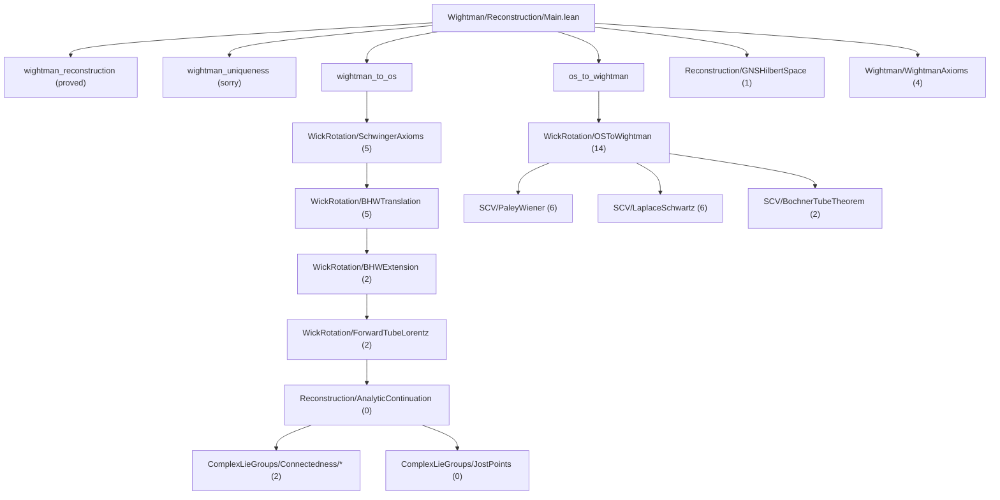

# Wightman TODO: OS Reconstruction Critical Path

Last updated: 2026-02-27

This TODO tracks only the proof blockers on the path to the OS reconstruction theorems:

- `wightman_to_os` (R->E)
- `os_to_wightman` (E'->R')
- `wightman_reconstruction`/`wightman_uniqueness` wiring completion

For the active BHW closure subgoals, see:
- `docs/development_plan_systematic.md`
- `docs/bhw_connectedness_strategy.md`
- `claude_to_codex.md` (source analysis and recommendations)

Count convention in this file: direct tactic holes only, i.e.
`rg -n --glob '*.lean' '^\s*sorry\b' OSReconstruction`.

## Live Sorry Census

| Scope | Direct `sorry` lines |
|-------|-----------------------|
| `OSReconstruction/Wightman` | 43 |
| `OSReconstruction/SCV` | 14 |
| `OSReconstruction/ComplexLieGroups` | 2 |
| `OSReconstruction/vNA` | 40 |
| **Whole project** | **99** |

Critical-path (OS theorem path + immediate prerequisites) direct total: **50**.

## Flow Chart Toward OS Reconstruction

## File-Level Blockers (Critical Path)

| File | Direct `sorry`s | Role in dependency chain |
|------|------------------|--------------------------|
| `Wightman/Reconstruction/Main.lean` | 1 | final uniqueness theorem |
| `Wightman/Reconstruction/GNSHilbertSpace.lean` | 1 | Hilbert/Poincare bridge infrastructure |
| `Wightman/WightmanAxioms.lean` | 4 | base axiom infrastructure (nuclear/BV placeholders) |
| `Wightman/Reconstruction/WickRotation/ForwardTubeLorentz.lean` | 2 | forward-tube growth + approach-direction setup |
| `Wightman/Reconstruction/WickRotation/BHWExtension.lean` | 2 | swap/locality transfer infrastructure |
| `Wightman/Reconstruction/WickRotation/BHWTranslation.lean` | 5 | translation/BV uniqueness chain |
| `Wightman/Reconstruction/WickRotation/SchwingerAxioms.lean` | 5 | R->E E0/E2/E4 hard steps |
| `Wightman/Reconstruction/WickRotation/OSToWightman.lean` | 14 | E'->R' continuation and BV transfer chain |
| `SCV/PaleyWiener.lean` | 6 | one-step Paley-Wiener continuation |
| `SCV/LaplaceSchwartz.lean` | 6 | Fourier-Laplace growth/BV technical core |
| `SCV/BochnerTubeTheorem.lean` | 2 | orthant-to-forward-tube extension |
| `ComplexLieGroups/Connectedness/ComplexInvariance/Core.lean` | 1 | BHW orbit-set connectedness (`hjoin` branch) |
| `ComplexLieGroups/Connectedness/BHWPermutation/PermutationFlow.lean` | 1 | BHW permutation overlap extension (`hExtPerm` branch) |

## Declaration-Level Blocker List

### `Wightman/Reconstruction/Main.lean` (1)

- `wightman_uniqueness` (line 80)

### `Wightman/Reconstruction/GNSHilbertSpace.lean` (1)

- `covariance_preHilbert` (line 912)

### `Wightman/WightmanAxioms.lean` (4)

- `schwartz_nuclear_extension` (line 303)
- `wightman_separately_continuous` (line 322)
- `spectrum_implies_distributional_bv` (line 488)
- `pointwise_limit_along_forwardCone_direction` (line 539)

### `Wightman/Reconstruction/WickRotation/ForwardTubeLorentz.lean` (2)

- `polynomial_growth_on_slice` (line 332)
- `wickRotation_not_in_PET_null` (line 719)

### `Wightman/Reconstruction/WickRotation/BHWExtension.lean` (2)

- `W_analytic_swap_distributional_agree` (line 89)
- `analytic_boundary_local_commutativity` (line 120)

### `Wightman/Reconstruction/WickRotation/BHWTranslation.lean` (5)

- `forwardTube_lorentz_translate_aux_core` (line 216)
- `W_analytic_translated_bv_eq` (line 316)
- `forward_tube_bv_integrable_translated` (line 339)
- `distributional_uniqueness_forwardTube_inter` (line 478)
- `bv_limit_constant_along_convex_path` (line 825)

### `Wightman/Reconstruction/WickRotation/SchwingerAxioms.lean` (5)

- `polynomial_growth_forwardTube_full` (line 58)
- `polynomial_growth_on_PET` (line 81)
- `schwinger_os_term_eq_wightman_term` (line 648)
- `bhw_pointwise_cluster_euclidean` (line 777)
- `W_analytic_cluster_integral` (line 813)

### `Wightman/Reconstruction/WickRotation/OSToWightman.lean` (14)

- `inductive_analytic_continuation` (line 154)
- `iterated_analytic_continuation` (line 176)
- `schwinger_holomorphic_on_base_region` (line 189)
- `extend_to_forward_tube_via_bochner` (line 204)
- `full_analytic_continuation` (lines 226, 232)
- `forward_tube_bv_tempered` (line 273)
- `bv_zero_point_is_evaluation` (line 409)
- `bv_translation_invariance_transfer` (line 439)
- `bv_lorentz_covariance_transfer` (line 471)
- `bv_local_commutativity_transfer` (line 500)
- `bv_positive_definiteness_transfer` (line 518)
- `bv_hermiticity_transfer` (line 545)
- `bvt_cluster` (line 650)

### `SCV/BochnerTubeTheorem.lean` (2)

- `bochner_local_extension` (line 111)
- `holomorphic_extension_from_local` (line 206)

### `SCV/LaplaceSchwartz.lean` (6)

- `fourierLaplace_continuousWithinAt` (line 109)
- `fourierLaplace_uniform_bound_near_boundary` (line 232)
- `fourierLaplace_polynomial_growth` (line 360)
- `polynomial_growth_of_continuous_bv` (line 389)
- `fourierLaplace_boundary_continuous` (line 440)
- `fourierLaplace_boundary_integral_convergence` (line 535)

### `SCV/PaleyWiener.lean` (6)

- `paley_wiener_half_line` (line 215)
- `paley_wiener_cone` (line 251)
- `paley_wiener_converse` (line 290)
- `paley_wiener_one_step` (line 351)
- `paley_wiener_one_step_simple` (line 382)
- `paley_wiener_unique` (line 412)

### `ComplexLieGroups/Connectedness/ComplexInvariance/Core.lean` (1)

- `orbitSet_isPreconnected` (remaining local branch `d ≥ 2`, `n > 0`, goal `hjoin`)

### `ComplexLieGroups/Connectedness/BHWPermutation/PermutationFlow.lean` (1)

- `iterated_eow_permutation_extension` (remaining local branch `d > 0`, `n ≥ 2`, `σ ≠ 1`, goal `hExtPerm`)

## Priority Execution Order

1. In parallel: close `ComplexLieGroups` root blockers and SCV load-bearing lemmas (`L1`, `P1`).
2. Finish SCV continuation chain (`LaplaceSchwartz`, `PaleyWiener`, `BochnerTubeTheorem`).
3. `WickRotation` R->E transport chain:
   `ForwardTubeLorentz` -> `BHWExtension` -> `BHWTranslation` -> `SchwingerAxioms`.
4. `WickRotation/OSToWightman` E'->R' transfer lemmas (centered on `forward_tube_bv_tempered`).
5. Finish wiring: `GNSHilbertSpace` remaining sorry and `Main.wightman_uniqueness`.

## Scope Guardrail

`NuclearSpaces/*` and most of `vNA/*` are not on the shortest dependency path to
closing the OS reconstruction theorem chain. They remain valuable infrastructure,
but they are lower priority until the blockers above are resolved.
