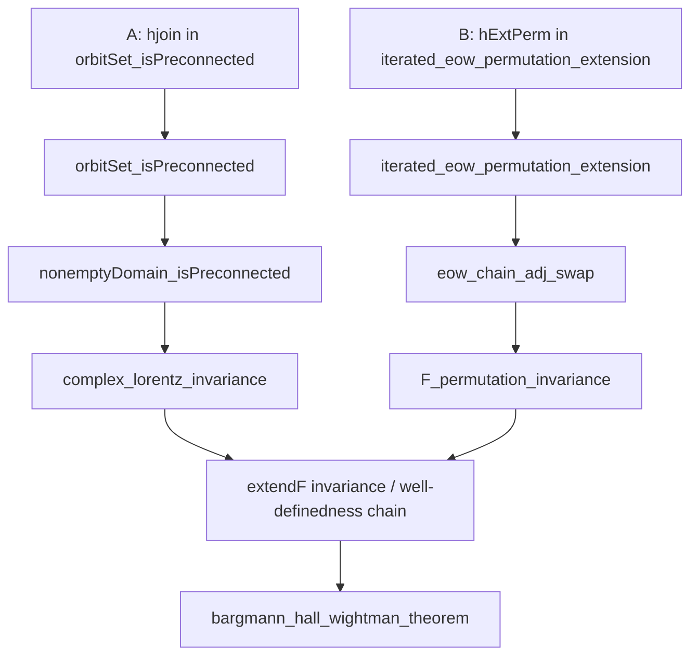

# BHW Connectedness Closure Strategy

Last updated: 2026-02-28

## Objective

Close all remaining `sorry` dependencies on the connectedness/BHW path
that block the constructive BHW theorem path (no axioms).

## Hard Constraints

- No axioms, no `by sorry`, no temporary theorem aliases that hide proof debt.
- Test-first workflow:
  - develop every nontrivial proof in `test/*.lean`,
  - compile there first,
  - port to working files only after test proof is stable.
- Avoid circular reasoning between:
  - `hExtPerm` construction,
  - `iterated_eow_permutation_extension`,
  - `F_permutation_invariance`.
- Keep `d = 0` and `d = 1` branches explicit and isolated from `d ≥ 2`.

## Current Blockers (Exact)

1. `orbitSet_isPreconnected` at
   `Connectedness/ComplexInvariance/Core.lean:1166`
- Hole A: `hjoin` branch (`d ≥ 2`, `n > 0`).
- Live branch: `d ≥ 2`, `n > 0`.

2. `iterated_eow_permutation_extension` at
   `Connectedness/BHWPermutation/PermutationFlow.lean:564`
- Hole B: `hExtPerm` in the nontrivial branch.
- Live branch: `σ ≠ 1`, `n ≥ 2`, `d ≠ 0`.

## 2026-02-28 Correction (d = 1 witness route)

- The previously suggested global fix
  `JostWitnessGeneralSigma.jostWitness_exists_d1` (for arbitrary `σ`) is not viable.
- Verified in scratch:
  - `test/d1_no_real_witness_swap_n2_probe.lean`
    proves `no_real_jost_witness_swap_n2`:
    for `d = 1`, `n = 2`, `σ = (0 1)`, there is no real
    `x : Fin 2 → Fin 2 → ℝ` with
    `x ∈ JostSet 1 2`, `realEmbed x ∈ ExtendedTube 1 2`, and
    `realEmbed (fun k => x (σ k)) ∈ ExtendedTube 1 2`.
  - strengthened in the same probe:
    `no_real_et_pair_swap_n2` and
    `no_real_adjacent_spacelike_witness_swap_n2`;
    even without `JostSet`, no real `x` can satisfy both ET constraints for
    `(0 1)` in `n = 2`.
- supporting sign infrastructure:
  `test/d1_real_witness_sign_obstruction_test.lean`.
- Consequence:
  - keep the split strategy explicit:
    1. `d ≥ 2`: existing real-Jost witness route remains viable.
    2. `d = 1`: requires a separate non-real-witness mechanism.

### Reference check note (Streater–Wightman, Ch. 2)

- The permuted-extended-tube overlap argument in the classical text is built
  by exhibiting a common real Jost neighborhood using vectors with two
  independent spatial directions (see the construction around formulas
  `(2-93)` and Figure 2-4 in `references/pct-spin-and-statistics-and-all-that-9781400884230_compress.pdf`).
- This aligns with the formal obstruction seen in Lean for `d = 1`:
  the real-witness overlap anchor used in `d ≥ 2` does not transfer directly
  to one spatial dimension.
- Operational consequence for this repo:
  - keep `d = 1` as a genuinely separate proof branch;
  - avoid spending cycles trying to force a `jostWitness_exists_d1` analog.

## 2026-02-28 Correction (midpoint route also fails in d = 1)

- The old adjacent-swap midpoint implication route is not only false for `d ≥ 2`;
  it is also false for `d = 1` (for `n ≥ 2`).
- Verified in scratch:
  - `test/midpoint_condition_d1_counterexample_test.lean`
    (`midpoint_condition_identity_false_d1`).
- Consequence:
  - Do not use midpoint/backstep induction as a closure strategy for either branch.

## 2026-02-28 New Reduction (compiled in test scope)

- New test file:
  `test/extendf_perm_overlap_base_reduction_test.lean` (compiles cleanly).
- Proven reduction:
  full ET-overlap permutation invariance for fixed `σ`
  can be reduced to a strictly weaker FT-base condition:
  ```
  hBase :
    ∀ w ∈ ForwardTube d n,
      (fun k => w (σ k)) ∈ ExtendedTube d n →
      extendF F (fun k => w (σ k)) = F w
  ```
  From `hBase`, one gets:
  1. full ET-overlap invariance of `extendF` for `σ`,
  2. forward-tube permutation invariance for `σ`.
- Practical consequence:
  the remaining geometric/analytic burden can be targeted at constructing
  this FT-base anchor condition, instead of directly proving the full ET-overlap
  equality in one shot.

## Dependency Flow (BHW path)



## Program-Level Approach

- Workstream B first (permutation extension), because it has the clearest existing scaffolding.
- Workstream A in parallel for infrastructure discovery, but do not block B integration on A.
- Merge only theorem-complete slices (no partial placeholder lemmas).

## Workstream B: Close `hExtPerm` (`BHWPermutation/PermutationFlow.lean`, iterated-EOW branch)

### B0. Lock Reduction Boundary
- Use existing theorem:
  `extendF_perm_overlap_of_adjSwap_connected_and_chain_hd2`.
- Target shape for `d ≥ 2`:
  - `hFwd_conn`: connectedness of all `adjSwapForwardOverlapSet`.
  - `hChain`: ET-preserving adjacent chain existence for any `σ` and `z`.

Acceptance gate:
- Scratch theorem with signature matching the exact assumptions of B0 compiles.

### B1. No-Go Results (already established in scratch)
- Record and preserve the following counterexample facts:
  - `ForwardTube` is not permutation-invariant in particle index order.
  - the old midpoint implication used for adjacent-chain back-propagation is false.
  - stronger: ET midpoint-backstep can fail even when the base point is already in `ET`
    (`midpoint_condition_on_ET_false`).
- Existing evidence:
  - `test/midpoint_condition_counterexample_test.lean`
  - `test/midpoint_route_vacuous_test.lean`
  - `test/jostset_et_counterexample_test.lean`

Acceptance gate:
- Counterexample files compile and are referenced in strategy comments near the blocked route.

### B2. Replace the Chain Route
- Do not pursue `hChain` via midpoint/ET-backstep assumptions.
- Replace with one of:
  1. direct `hExtPerm` construction (analytic continuation on ET overlap), or
  2. a new geometric criterion that is actually provable in this formalization.

Acceptance gate:
- The chosen route proves `hExtPerm` without introducing false intermediate lemmas.

### B3. `hFwd_conn` Construction
- Complete the connectedness route already scaffolded in `Connectedness.lean`:
  1. Use slice-union machinery (`adjSwapForwardOverlapSet_eq_iUnion_slices`).
  2. Prove connectedness of index set via
     `indexSet_isConnected_of_real_double_coset_generation`.
  3. Supply the missing real-double-coset generation lemma.

Notes:
- This is likely the hardest part of B.
- If direct generation is too heavy, introduce an equivalent but easier-to-prove index connectivity criterion and rewrite only local consumers.

Acceptance gate:
- For arbitrary `i hi`, obtain:
  `IsConnected (adjSwapForwardOverlapSet (d := d) n i hi)`.

### B4. Integrate in iterated-EOW nontrivial branch
- Split nontrivial branch as:
  - `d = 0`: already handled.
  - `d = 1`: either direct proof or temporary explicit `d = 1` sub-branch with isolated TODO.
  - `d ≥ 2`: use B0+B2+B3.
- Port from test file only after full compile.

Acceptance gate:
- `iterated_eow_permutation_extension` has no `sorry`.

## Workstream A: Close `hjoin` (`ComplexInvariance/Core.lean` orbit-set branch)

### A0. Keep interface fixed
Required output remains:
`∀ Λ ∈ orbitSet w, JoinedIn (orbitSet w) 1 Λ` for `d ≥ 2`, `n > 0`.

### A1. Preferred route: quotient/fiber route (reuse existing infrastructure)
Use already-developed internal lemmas:
- `orbitSet_isPreconnected_of_stabilizer_connected_quotTube`,
- `orbitSetToQuotTube_isQuotient`,
- fiber connectedness reductions.

Needed new infrastructure:
1. Stabilizer connectedness theorem for FT points in `d ≥ 2`.
2. Preconnectedness/connectedness of `orbitQuotTube w`.

Decision gate:
- If both (1) and (2) are obtained with manageable lemmas, use this route and derive `hjoin` from preconnectedness + local path connectedness machinery.

### A2. Fallback route: explicit joining via decomposition
If A1 stalls:
- Build decomposition-based join infrastructure:
  1. real-factor path (`ofReal`) already available,
  2. complex factor path under verified geodesic-convexity hypotheses,
  3. concatenation in `orbitSet`.
- Do not reintroduce the previously removed false global geodesic endpoint lemma.

Decision gate:
- Any proposed geometric lemma must be validated in a dedicated counterexample/probe scratch file before integration.

### A3. Integrate at line 1890
- Keep branch split:
  - `n = 0`, `d = 0`, `d = 1` unchanged,
  - only replace `d ≥ 2`, `n > 0` `hjoin`.

Acceptance gate:
- `orbitSet_isPreconnected` has no `sorry`.

## Refactoring Plan (to reduce blocker friction)

Create focused theorem clusters (can remain in one file initially, then split):
1. `Connectedness.OrbitSetFiber`:
- stabilizer, quotient, orbit-image connectedness.
2. `Connectedness.PermutationET`:
- ET permutation membership, chain construction, overlap connectedness.
3. `Connectedness.EOWIterated`:
- final `hExtPerm` to iterated extension handoff.

Rule:
- no API reshuffle and proof changes in the same commit; keep mechanical refactors separate.

## Commit/PR Sequencing

1. PR-B1/B2:
- ET permutation membership + chain existence.
2. PR-B3:
- forward-overlap connectedness infrastructure.
3. PR-B4:
- close `hExtPerm`.
4. PR-A1 or PR-A2:
- close `hjoin`.
5. PR-Cleanup:
- remove dead helper lemmas, update TODO/README proof-flow notes.

## Verification Matrix

Per milestone:
- `lake env lean test/<new_scratch>.lean`
- `lake env lean OSReconstruction/ComplexLieGroups/Connectedness.lean`

Before merge:
- `lake env lean OSReconstruction/ComplexLieGroups.lean`
- targeted downstream files:
  - `OSReconstruction/Wightman/Reconstruction/AnalyticContinuation.lean`
  - `OSReconstruction/Wightman/Reconstruction/WickRotation/*.lean`

## Immediate Next Actions

1. Land the refactor foundation:
- keep extracting self-contained utilities from large submodules into focused `Connectedness/*` files.
2. Execute B3 spike:
- isolate the minimal missing theorem for index-set connectedness from real double-coset generation.
3. Start direct-B route prototype in `test/`:
- attempt `hExtPerm` without midpoint-chain assumptions.

## Refactor Progress (2026-02-26)

- `Connectedness.lean` is a thin orchestrator import file (`7` lines).
- `ComplexInvarianceCore.lean` is now a thin wrapper (`2` lines) over:
- `OSReconstruction/ComplexLieGroups/Connectedness/ComplexInvariance/Core.lean` (`1401` lines)
- `OSReconstruction/ComplexLieGroups/Connectedness/ComplexInvariance/Extend.lean` (`288` lines)
- `BHWPermutation.lean` is now a thin wrapper (`2` lines) over:
- `OSReconstruction/ComplexLieGroups/Connectedness/BHWPermutation/Adjacency.lean` (`1309` lines)
- `OSReconstruction/ComplexLieGroups/Connectedness/BHWPermutation/PermutationFlow.lean` (`992` lines)
- Previously extracted modules retained:
- `OSReconstruction/ComplexLieGroups/Connectedness/DimensionZero.lean`
- `OSReconstruction/ComplexLieGroups/Connectedness/ForwardTubeDomain.lean`
- `OSReconstruction/ComplexLieGroups/Connectedness/PermutedTube.lean`
- `OSReconstruction/ComplexLieGroups/Connectedness/PermutedTubeConnected.lean`
- Current blocker sorrys remain exactly two:
- orbit-set preconnectedness (`ComplexInvariance/Core`, `d ≥ 2` joinability branch),
- iterated EOW permutation extension (`BHWPermutation/PermutationFlow`, `hExtPerm` nontrivial branch).
